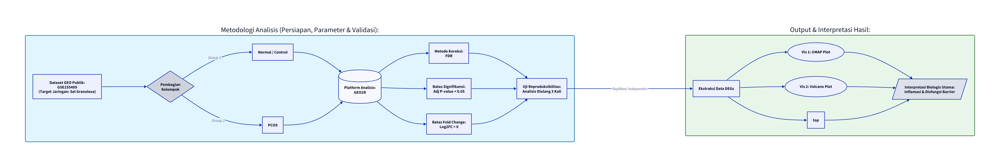
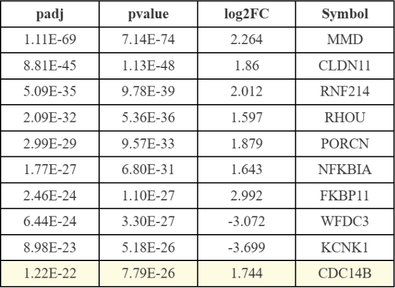

### Analisis Patogenesis PCOS Melalui Ekspresi Gen Diferensial (DEGs) pada Sel Granulosa 

### Latar Belakang
*Polycystic Ovary Syndrome* (PCOS) adalah gangguan endokrin dan metabolik yang menjadi penyebab utama infertilitas anovulatorik pada wanita usia reproduksi (Escobar-Morreale, 2018). Salah satu karakteristik utama PCOS adalah terhentinya perkembangan folikel ovarium (*follicular arrest*). Secara patofisiologis, sel granulosa, sel somatik penyokong folikel, memainkan peran krusial dalam patogenesis penyakit ini (Welt et al., 2005). Analisis komparatif ini bertujuan untuk mengevaluasi profil *Differentially Expressed Genes* (DEGs) pada sel granulosa pasien PCOS dibandingkan dengan wanita sehat (Kontrol), guna mengidentifikasi gen penggerak (*driver genes*) yang merusak fungsi reproduksi. 

[Image of Polycystic Ovary Syndrome pathology]

### Metodologi Analisis

*Gambar 1. Alur kerja analisis transkriptomik dari persiapan data hingga interpretasi hasil.*

Seperti yang diilustrasikan pada Gambar 1, tahapan analisis dirancang secara sistematis. Data matriks ekspresi diekstraksi dari *Gene Expression Omnibus* (GEO) publik dengan aksesi GSE155489 (Barrett et al., 2012). Analisis komparatif antara kelompok Kontrol (Normal) dan PCOS dieksekusi menggunakan perangkat lunak statistik berbasis web, GEO2R. Kontrol kualitas yang ketat diterapkan menggunakan metode koreksi *False Discovery Rate* (FDR) dengan ambang batas *Adjusted p-value* < 0.05 untuk menyaring gen yang valid secara statistik (Ritchie et al., 2015). Output data DEG yang lolos seleksi kemudian diekstraksi untuk divisualisasikan.

### Hasil dan Interpretasi Biologis

### 1. Evaluasi Kualitas Data (Boxplot)
Sebelum mengidentifikasi gen spesifik, sangat penting untuk memastikan data terbebas dari bias teknis atau *batch effect* (Mahra et al., 2025).

*Gambar 2. Distribusi nilai median ekspresi antar sampel yang telah dinormalisasi.*

Berdasarkan visualisasi Boxplot pada Gambar 2, nilai median intensitas ekspresi (Log2) pada seluruh sampel berada pada garis horizontal yang sejajar. Kesejajaran ekuilibrium ini mengonfirmasi bahwa data hitungan ekspresi dari repositori GEO telah ternormalisasi dengan sangat baik. Variasi yang dianalisis dipastikan murni akibat kondisi patologis PCOS, bukan akibat kesalahan instrumen.

### 2. Pemisahan Identitas Molekuler (UMAP)
Untuk memvalidasi apakah penyakit ini secara fundamental merombak profil genetik, dilakukan analisis proyeksi dimensi reduksi spasial (McInnes et al., 2020). 

[Image of Granulosa cells in ovarian follicle]

*Gambar 3. UMAP Plot menunjukkan pemisahan koordinat spasial yang tegas berdasarkan kondisi penyakit.*

Berdasarkan hasil visualisasi pada Gambar 3, UMAP plot menampilkan klasterisasi spasial yang sangat tajam dan tanpa tumpang tindih antara kelompok sampel Kontrol dan PCOS. Jarak yang merentang jauh antar kedua klaster ini membuktikan bahwa sel granulosa penderita PCOS telah kehilangan identitas molekuler normalnya akibat paparan penyakit.

### 3. Asimetri Transkripsional Global (Volcano Plot)
Setelah validasi jarak molekuler dipastikan, distribusi keseluruhan gen yang mengalami perubahan aktivitas divisualisasikan.

*Gambar 4. Volcano Plot menunjukkan distribusi DEGs yang asimetris.*

Analisis diferensial pada Gambar 4 mengungkap fenomena asimetri ekstrem. Lanskap grafik sangat didominasi oleh kepadatan titik pada area LogFC positif, yang merepresentasikan gen *up-regulation* secara signifikan. Dominasi tak lazim ini mengindikasikan terjadinya hiperaktivitas transkripsional di dalam sel granulosa PCOS. Hal ini merupakan respons kompensasi seluler terhadap stres kronis di lingkungan ovarium, yang memaksa sel terus menerus memproduksi mRNA secara berlebihan (Mahra et al., 2025).

### 4. Karakterisasi Molekuler Penggerak Utama (Top DEGs)
Untuk memahami kerusakan spesifik yang terjadi, data difokuskan pada gen penyandi fungsional dengan nilai signifikansi tertinggi.

*Gambar 5. Daftar gen teratas beserta metrik signifikansinya.*

Merujuk pada metrik di Gambar 5, disfungsi sel granulosa pada PCOS terbukti didalangi oleh malfungsi beberapa jalur mekanisme:
1. Gen **MMD** (*Monocyte to macrophage differentiation associated*) menempati urutan signifikansi teratas secara absolut (*padj* = 1.11E-69, Log2FC = 2.264), diikuti oleh peningkatan gen **NFKBIA** (Log2FC = 1.643). Sinergi keduanya mengonfirmasi aktivasi makrofag folikuler agresif yang menciptakan badai sitokin di dalam ovarium yang merusak oosit (Feng et al., 2023; Rostamtabar et al., 2021).
2. Lonjakan ekspresi drastis terjadi pada gen **CLDN11** (Log2FC = 1.86) yang menyandikan protein *tight junction*. Over ekspresi ini mengubah *Blood Follicle Barrier* menjadi kaku dan fibrotik, memblokir lalu lintas nutrisi dan membuat sel telur kelaparan (Zhu et al., 2006).
3. Penurunan regulasi pada gen **KCNK1** (Log2FC = -3.699) merusak fungsi kanal kalium, menghancurkan stabilitas kelistrikan seluler, dan membuat folikel menjadi kebal terhadap sinyal ovulasi dari tubuh (Kim et al., 2020).

### Kesimpulan
Pipeline komputasi transkriptomik yang diterapkan pada dataset GSE155489 secara komprehensif membuktikan bahwa PCOS memicu pergeseran molekuler yang masif, asimetris, dan destruktif pada sel granulosa. Disregulasi konstelasi gen kunci yakni hiperaktivasi MMD dan NFKBIA yang memicu inflamasi fokal, CLDN11 yang memicu fibrosis barier folikel, serta represi KCNK1 yang memicu kegagalan ion seluler mentransformasi lingkungan ovarium sehat menjadi lingkungan patologis yang memicu berhentinya pematangan sel telur. 

### Referensi dan Tautan Akses

1. **Barrett, T., et al. (2012).** *NCBI GEO: archive for functional genomics data sets—update.* Nucleic Acids Research. [Akses Artikel](https://academic.oup.com/nar/article/41/D1/D991/1053229)
2. **Zhu, Yihong, et al.(2006)** *Differences in expression patterns of the tight junction proteins, claudin 1, 3, 4 and 5, in human ovarian surface epithelium as compared to epithelia in inclusion cysts and epithelial ovarian tumours.* International journal of cancer [Akses Artikel](https://onlinelibrary.wiley.com/doi/abs/10.1002/ijc.21506)
3. **Escobar-Morreale, H. F. (2018).** *Polycystic ovary syndrome: definition, aetiology, diagnosis and treatment.* Nature Reviews Endocrinology. [Akses Artikel](https://www.nature.com/articles/nrendo.2018.24)
4. **Welt, Corrine K., et al. (2005)** *Follicular arrest in polycystic ovary syndrome is associated with deficient inhibin A and B biosynthesis.* The Journal of Clinical Endocrinology & Metabolism . [Akses Artikel](https://academic.oup.com/jcem/article-abstract/90/10/5582/2838977)
5. **Kim, Jun-Mo, et al. (2020)** *Role of potassium channels in female reproductive system.* Obstetrics & gynecology science [Akses Artikel](https://pmc.ncbi.nlm.nih.gov/articles/PMC7494774/)
6. **Feng, Y., et al. (2023).** *The role of macrophages in polycystic ovarian syndrome and its typical pathological features: a narrative review.* Biomedicine & Pharmacotherapy, [Akses Artikel](https://www.sciencedirect.com/science/article/pii/S0753332223012684)
7. **McInnes, L., et al. (2020).** *UMAP: Uniform Manifold Approximation and Projection for Dimension Reduction.* arXiv preprint. [Akses Artikel](https://arxiv.org/abs/1802.03426)
8. **Ritchie, M. E., et al. (2015).** *limma powers differential expression analyses for RNA-sequencing and microarray studies.* Nucleic Acids Research. [Akses Artikel](https://academic.oup.com/nar/article/43/7/e47/2414268)
9. **Rostamtabar, M., et al. (2021).** *Pathophysiological roles of chronic low-grade inflammation in polycystic ovary syndrome.* Journal of Cellular Physiology. [Akses Artikel](https://onlinelibrary.wiley.com/doi/10.1002/jcp.29912)
10. **Mahra, K., et al. (2025).** *Unravelling the molecular landscape of polycystic ovary syndrome (PCOS) and role of inflammation through transcriptomics analysis of human ovarian granulosa cells.* Genomics & Informatics. [Akses Artikel](https://link.springer.com/article/10.1186/s44342-025-00051-6)
