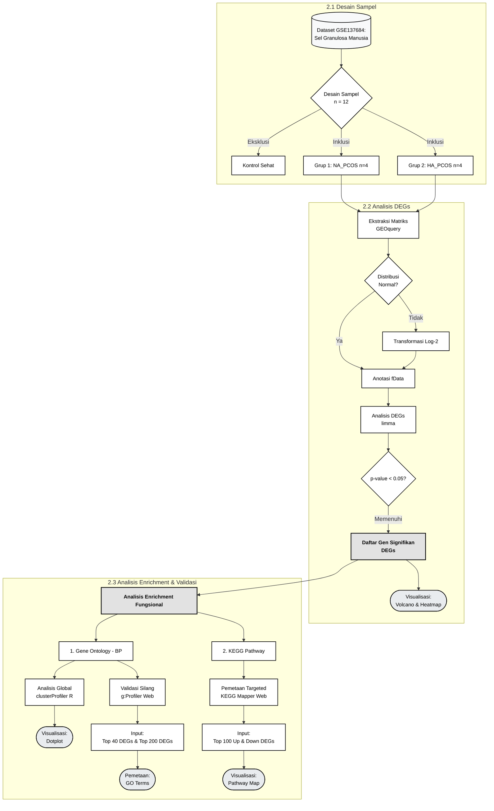
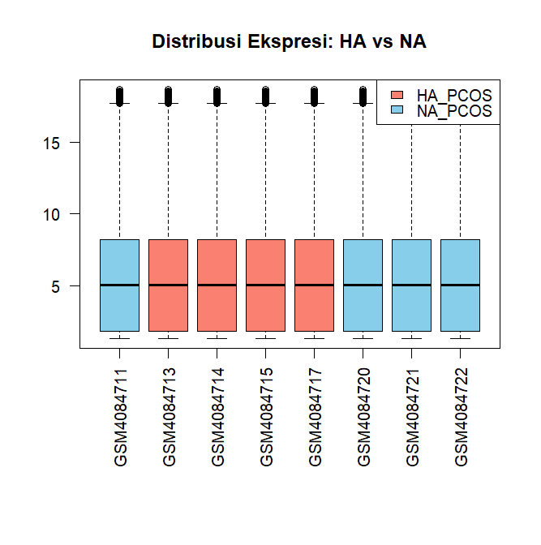
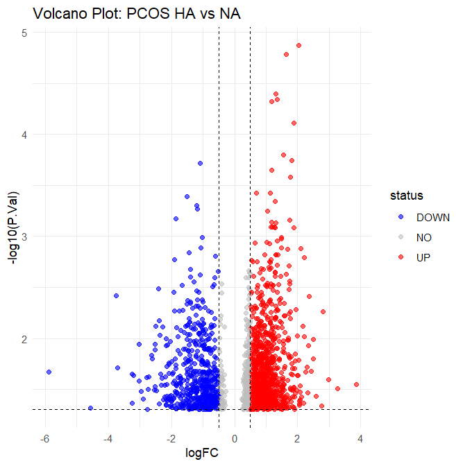
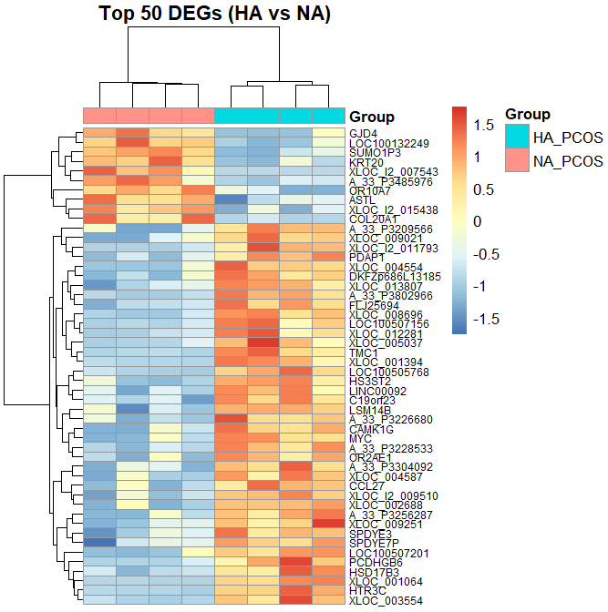
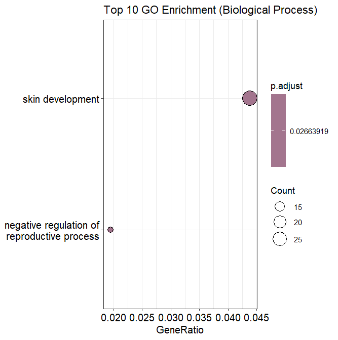

# Analisis Transkriptomik: Perbandingan Profil Genetik Sel Granulosa pada Subtipe Normoandrogenic (NA) dan Hyperandrogenic (HA) PCOS

### Latar Belakang
*Polycystic Ovary Syndrome* (PCOS) merupakan salah satu gangguan reproduksi yang paling umum, secara klinis, PCOS terbagi menjadi dua subtipe utama berdasarkan kadar testosteron: *Normoandrogenic* (NA) dan *Hyperandrogenic* (HA) yang identik dengan gejala hirsutisme, obesitas, dan resistensi insulin. Meskipun perbedaan klinisnya terlihat jelas, profil ekspresi genetik yang membedakan kedua subtipe ini di tingkat seluler belum sepenuhnya dipetakan. Analisis komparatif ini bertujuan untuk mengidentifikasi *Differentially Expressed Genes* (DEGs) secara komputasional guna mengungkap mekanisme molekuler spesifik yang membedakan sel granulosa pada subtipe HA dan NA PCOS.

---

### Metodologi Analisis

### Hasil dan Interpretasi Biologis

#### 1. Evaluasi Kualitas Data (Boxplot)

*Gambar 2. Distribusi nilai median ekspresi antar-sampel yang telah dinormalisasi.*

Berdasarkan visualisasi *Boxplot* pada **Gambar 2**, nilai median intensitas ekspresi (Log2) pada seluruh sampel berada pada garis ekuilibrium yang sejajar. Kesejajaran ini membuktikan bahwa tahap pemrosesan pra-analitik berjalan secara optimal, mengeliminasi varian teknis yang tidak diinginkan sehingga data valid untuk dibandingkan.

#### 2. Asimetri Transkripsional Global (Volcano Plot)

*Gambar 3. Volcano plot mendemonstrasikan perombakan transkripsional yang masif pada subtipe HA.*

Analisis *differential expression* yang dipetakan melalui *Volcano Plot* (**Gambar 3**) mengungkap perombakan transkripsional yang ekstrem. Ditemukan sebanyak 1.866 gen (DEGs) yang terekspresi secara diferensial secara signifikan. Tingginya angka disregulasi genetik ini membuktikan bahwa HA dan NA memiliki dasar patofisiologi tingkat seluler yang sangat berbeda, di mana sel granulosa pada lingkungan *hyperandrogenic* bereaksi dengan hiperaktivitas kompensatorik yang tidak wajar.

#### 3. Pemisahan Identitas Molekuler (Heatmap)

*Gambar 4. Heatmap dari Top 50 DEGs memperlihatkan segregasi klaster yang sempurna antar subtipe.*

Klasterisasi hierarkis pada **Gambar 4** memberikan validasi spasial yang tajam. Empat sampel dari penderita HA membentuk kelompok pola ekspresi genetik (blok warna) yang sangat seragam dan benar-benar bertolak belakang dengan kelompok NA. Hal ini menegaskan eksistensi *molecular signature* spesifik pada masing-masing kondisi.

#### 4. Pemetaan Fungsi Biologis Translasi (Gene Ontology)

*Gambar 5. Analisis pengayaan mengungkap aktivasi jalur kesehatan kulit dan supresi fungsi reproduksi.*

Analisis *Gene Ontology* (Biological Process) pada **Gambar 5** sukses menerjemahkan data komputasional ke dalam realitas klinis pasien. Terdapat jalur perkembangan Jaringan Kulit (Skin Development) yang emvalidasi manifestasi fisik di dunia nyata. Hiperaktivasi konstelasi gen epitelial ini merupakan mekanisme seluler yang menjadi cikal bakal parahnya gejala hirsutisme (pertumbuhan rambut berlebih) dan jerawat membandel pada penderita HA PCOS.
Kemudian hasil juga menunjukkan adanya Supresi Reproduksi (Negative Regulation of Reproductive Process) sebagai bukti patofisiologi molekuler secara gamblang. Kerusakan transkripsional pada subtipe HA secara langsung mematikan mekanisme pematangan oosit, mendasari kegagalan ovulasi yang persisten.

#### 5. Validasi Silang Fungsional: Analisis Sinyal Ekstrem vs. Sistemik (g:Profiler)
Untuk memvalidasi pergeseran global dari ribuan gen sebelumnya, analisis pengayaan fungsional sekunder dilakukan menggunakan basis data g:Profiler dengan dua pendekatan *threshold* (ambang batas) untuk melihat efek penyakit dari dua sudut pandang berbeda: **Top 40 DEGs** (sinyal sangat ekstrem) dan **Top 200 DEGs** (sinyal sistemik jaringan).

*Gambar 6. Analisis pengayaan mengungkap pemetaaan gejala fisik.*

**A. Sinyal Ekstrem (Top 40 DEGs): Pemetaan Gejala Fisik**
Pada **Gambar 6** ketika analisis difokuskan murni pada 40 gen dengan perubahan ekspresi paling drastis (20 gen *Up* dan 20 gen *Down*), algoritma mendeteksi sinyal patologis yang sangat mengerucut pada ciri fisik pasien:
* **Hiperaktivasi Jaringan Kulit & Keratinisasi:** Analisis *Gene Ontology* mendeteksi pengayaan yang sangat tajam pada jalur Diferensiasi Keratinosit (*Keratinocyte differentiation*, padj = 1.88E-4) dan pembentukan selubung kulit luar (*Cornified envelope*). Sinyal ekstrem ini adalah fondasi molekuler mutlak dari keluhan utama pasien HA PCOS, di mana paparan androgen berlebih memicu penebalan epidermis dan pertumbuhan rambut folikel yang tidak wajar (*hirsutisme*).

*Gambar 6. Analisis pengayaan mengungkap pemetaaan gejala fisik.*

**B. Sinyal Sistemik (Top 200 DEGs): Kerusakan Mesin Seluler**
Ketika cakupan diperluas menjadi 200 gen pada **Gambar 7** untuk menangkap kerusakan arsitektur sel yang lebih luas, efek pengenceran statistik (*dilution effect*) menyembunyikan jalur keratinisasi, dan memunculkan kerusakan mesin seluler raksasa yang tidak terdeteksi sebelumnya:
* **Penghentian Siklus Pembelahan (*Cell Cycle*):** Terdeteksinya disregulasi kolektif pada gen-gen pengatur siklus sel membuktikan landasan molekuler dari *follicular arrest* (kegagalan sel telur untuk matang dan berovulasi).
* **Kekacauan Persinyalan & Serangan Imun:** Munculnya jalur *Signaling receptor activity* dan *MHC class I protein complex* mengindikasikan bahwa sel granulosa tidak hanya kehilangan kemampuannya merespons sinyal hormon (seperti FSH/LH), tetapi juga mengalami stres seluler parah yang memancing reaksi sistem imun bawaan lokal.

Penggabungan dua tingkat analisis komputasional ini secara komprehensif membuktikan bahwa PCOS subtipe *Hyperandrogenic* mematikan mesin reproduksi utama di tingkat internal ovarium (*Cell Cycle arrest*), sekaligus memfokuskan sisa hiperaktivitas genetiknya untuk memicu keluhan kelainan fisik eksternal (*Keratinisasi/Hirsutisme*).

#### 7. Pemetaan Mekanisme Persinyalan (Targeted KEGG Pathway Mapping)
Mengingat ketatnya penyesuaian statistik global yang sering menutupi sinyal pada studi berukuran sampel kecil, pemetaan jalur secara langsung dilakukan menggunakan **KEGG Mapper** pada klaster gen dengan tingkat disregulasi tertinggi. Analisis ini bertujuan untuk memetakan secara visual diagram kabel (*wiring diagram*) persinyalan seluler yang rusak dan menggabungkannya dengan temuan biologis dari Gene Ontology (GO).

Pemetaan spasial gen-gen ini ke dalam pangkalan data KEGG (Organisme: *Homo sapiens*) memvalidasi temuan GO sebelumnya dan mengungkap mekanisme spesifik di balik kerusakan sel granulosa pada HA PCOS:

* **Hiperaktivasi Jalur Inflamasi dan Stres Seluler:** Temuan aktivasi sistem imun pada GO tervalidasi dengan kuat melalui deteksi gen yang memetakan langsung pada jalur interaksi imun, yakni **Cytokine-cytokine receptor interaction (4 gen ditemukan)** dan **MAPK signaling pathway (5 gen ditemukan)**. Hal ini membuktikan bahwa sel granulosa secara aktif merespons sinyal pro-inflamasi yang memicu peradangan fokal di lingkungan folikel.
* **Disregulasi Endokrin dan Resistensi Insulin:** Pemetaan menyoroti anomali pada arsitektur hormon dan metabolisme melalui aktivasi **GnRH secretion (2 gen ditemukan)**, **Steroid hormone biosynthesis (1 gen ditemukan)**, serta **PI3K-Akt signaling pathway (2 gen ditemukan)** dan **Insulin resistance (1 gen ditemukan)**. Klaster ini adalah representasi molekuler mutlak dari karakteristik utama pasien HA PCOS, di mana ovarium memproduksi androgen berlebih yang diperparah oleh hilangnya sensitivitas terhadap insulin.
* **Validasi Gejala Kulit (Hirsutisme):** Temuan jalur **Cornified envelope formation (1 gen ditemukan)** selaras secara sempurna dengan anomali Diferensiasi Keratinosit pada temuan GO, memperkuat bukti bahwa sisa hiperaktivitas genetik memicu manifestasi fisik berupa penebalan epidermis dan pertumbuhan rambut berlebih.

Kombinasi antara proses biologis makro (GO) dan pemetaan persinyalan mikro (KEGG) secara komprehensif membuktikan bahwa patofisiologi HA PCOS berakar pada miskomunikasi antar-sel tingkat parah yang berujung pada inflamasi lokal ovarium, resistensi insulin, dan hiperandrogenisme fungsional. Hasil KEGG juga menunjukkan dua mekanisme utama penyebab kerusakan sel granulosa pada HA PCOS:

**1. Badai Inflamasi dan Miskomunikasi Parakrin (Cytokine-Cytokine Receptor Interaction)**

*Gambar 7. Pemetaan interaksi protein pada Cytokine-cytokine receptor interaction pathway. Area yang di-highlight menunjukkan disregulasi spesifik pada keluarga IL-6, TNF, dan TGF-beta.*

Temuan aktivasi sistem imun pada GO tervalidasi secara visual melalui peta interaksi reseptor sitokin. Analisis menyoroti disregulasi kunci pada keluarga gen pro-inflamasi dan pengatur pertumbuhan folikel, di antaranya:
* **Keluarga Interleukin (IL-6/12) & TNF:** Gen seperti *LIF*, *DCR3 (TNFRSF6B)*, dan *OPG (TNFRSF11B)* terdeteksi mengalami anomali. Kehadiran gen-gen ini membuktikan tingginya sensitivitas sel granulosa terhadap stresor inflamasi, menciptakan peradangan kronis di lingkungan mikro ovarium.
* **Keluarga TGF-beta:** Keterlibatan gen *BMP8* mengonfirmasi kerusakan pada jalur komunikasi yang secara fisiologis krusial untuk mengatur pematangan sel telur.

 

**2. Kekacauan Sinyal Endokrin (GnRH Secretion Pathway)**

*Gambar 8. Pemetaan interaksi pada GnRH Secretion Pathway. Anomali molekuler terdeteksi secara jelas pada infrastruktur Saluran Kalsium (L-type, T-type, Cav3.2).*

Selain inflamasi, ovarium penderita HA PCOS memiliki karakteristik disfungsi endokrin dan ketidakseimbangan hormon yang parah. Visualisasi pada jalur sekresi GnRH (*Gonadotropin-Releasing Hormone*) menunjukkan anomali spesifik pada infrastruktur **Saluran Kalsium (Calcium Channels)**.
* **Hiperaktivasi Saluran Kalsium:** Pemetaan mendeteksi disregulasi pada kotak **L-type**, **T-type**, dan **Cav3.2** (merepresentasikan gen *CACNA1C* dan *CACNA1H*). 
* Secara fisiologis, influks kalsium adalah pemicu utama eksositosis (pelepasan) vesikel hormon. Disregulasi persinyalan kalsium pada sel-sel reproduksi ini memberikan bukti mekanistik tentang mengapa pasien HA PCOS mengalami malfungsi sekresi hormon dan ketidakmampuan ovarium merespons sinyal gonadotropin secara normal.

---

### Kesimpulan

Analisis in-silico ini mendemonstrasikan bukti nyata bahwa PCOS tipe *Hyperandrogenic* (HA) dan *Normoandrogenic* (NA) bukan sekadar perbedaan keparahan gejala klinis, melainkan dua entitas dengan pola perombakan molekuler yang mendasar di dalam ovarium. Modifikasi epigenetik via lncRNA dan anomali persinyalan parakrin pada HA PCOS memfokuskan efek destruktifnya untuk merusak stabilitas aksis reproduksi dan memicu pertumbuhan jaringan kulit secara abnormal.
