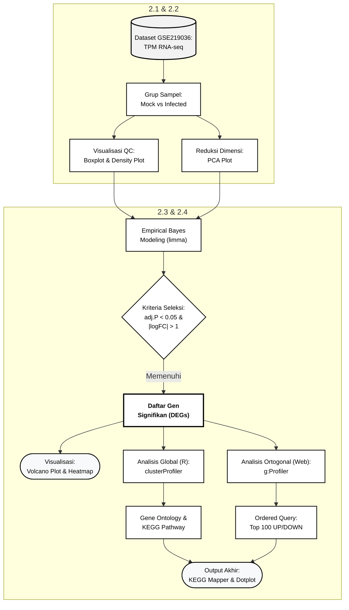

### Profiling Transkriptomik Respons Inang pada Infeksi Mpox Clade IIb

***

### 1. Pendahuluan
Mpox yang disebabkan oleh virus Mpox Clade IIb telah memicu krisis kesehatan global karena tingkat penularannya yang meluas dan manifestasi klinis yang ditandai dengan lesi kulit vesikuler dan pustuler yang parah (Watanabe et al., 2023). Secara patologis, interaksi antara virus dan sel inang memicu perubahan molekuler yang sangat kompleks. Penelitian ini bertujuan untuk membedah mekanisme patogenesis dan respons imun sel inang pada tingkat transkriptomik menggunakan data RNA sequencing. Pemetaan gen yang terekspresi secara diferensial beserta jalur molekulernya dilakukan untuk mengidentifikasi biomarker patologis krusial serta menemukan protein target potensial dalam pengembangan rancangan vaksin in silico (Abdi et al., 2022).

### 2. Metode Penelitian
Analisis profil transkriptomik ini menggunakan pendekatan bioinformatika terintegrasi berbasis bahasa pemrograman R dan pangkalan data fungsional web. Rincian tahapan analisis adalah sebagai berikut:

**2.1. Akuisisi dan Prapemrosesan Data**
Data ekspresi gen mentah dalam format Transcripts Per Million diperoleh dari pangkalan data Gene Expression Omnibus dengan nomor aksesi GSE219036. Dataset ini mencakup transkriptom sel manusia grup kontrol (Mock) dan grup yang diinfeksi virus Mpox Clade IIb (Infected). Transformasi logaritmik basis dua dengan penambahan pseudo count satu log2(x+1) diaplikasikan untuk menstabilkan varians dan menangani dominasi nilai nol yang menjadi karakteristik data RNA sequencing.

**2.2. Kontrol Kualitas dan Reduksi Dimensi**
Pemeriksaan kualitas data dilakukan secara visual menggunakan Boxplot dan Density Plot untuk memastikan bahwa proses normalisasi telah berhasil menyelaraskan rentang dinamis distribusi data antar sampel. Reduksi dimensi menggunakan Principal Component Analysis dieksekusi untuk mengevaluasi klasterisasi spasial sampel dan memvalidasi variasi biologis utama di dalam dataset.

**2.3. Analisis Ekspresi Gen Diferensial**
Identifikasi gen yang mengalami perubahan ekspresi secara signifikan dilakukan menggunakan paket R limma (Ritchie et al., 2015). Algoritma Empirical Bayes digunakan untuk meminjam informasi varians di seluruh gen sehingga meningkatkan kekuatan statistik pada ukuran sampel kecil. Gen diklasifikasikan signifikan jika memenuhi ambang batas nilai p yang disesuaikan kurang dari 0.05 dan nilai mutlak log Fold Change lebih dari 1. Visualisasi hasil dilakukan menggunakan Volcano Plot beranotasi ggrepel dan Heatmap berskala Z score.

**2.4. Analisis Pengayaan Fungsional**
Pemetaan Gene Ontology dan jalur Kyoto Encyclopedia of Genes and Genomes dilakukan menggunakan paket clusterProfiler di R untuk mendapatkan gambaran global. Analisis ortogonal mendalam dilakukan melalui web g:Profiler dengan memisahkan 100 gen teratas yang naik dan 100 gen teratas yang turun menggunakan algoritma Ordered Query dan ambang batas signifikansi g:SCS. Pemetaan spasial dan topologi interaksi gen divisualisasikan menggunakan alat KEGG Mapper Color.

***

### 3. Hasil dan Interpretasi Biologis

### 3.1. Validasi Kualitas Data dan Klasterisasi Spasial
Kontrol kualitas melalui Boxplot dan Density Plot membuktikan bahwa transformasi logaritmik telah mengeliminasi bias teknis antar replikat (Ritchie et al., 2015). 

*Gambar 1. Boxplot dan Density Plot.*

Lebih lanjut, hasil Principal Component Analysis memperlihatkan klasterisasi yang terpisah sempurna pada sumbu utama PC1. Hal ini membuktikan secara matematis bahwa intervensi virus Mpox merupakan aktor tunggal yang merombak arsitektur genetik sel inang, mengalahkan faktor gangguan lingkungan lainnya (Watanabe et al., 2023).

*Gambar 2. PCA Plot.*

### 3.2. Lanskap Badai Transkripsional
Sifat infeksi Mpox yang akut terekam secara visual pada Volcano Plot. Ribuan gen terdorong ke arah ekstrem kanan dan kiri, menciptakan fenomena badai transkripsional (Cai et al., 2023). Virus tidak hanya mengubah segelintir gen, melainkan membajak ribuan fungsi normal sel inang secara bersamaan.

*Gambar 3. Volcano Plot.*

Analisis Heatmap pada 50 gen teratas memperlihatkan blok warna yang memisah tajam dan konsisten. Kondisi ini mengonfirmasi bahwa sel sel manusia merespons invasi virus Mpox dengan cara yang sangat seragam, membuktikan tingginya keandalan data untuk mencari target terapi.

*Gambar 4. Heatmap.*

### 3.3. Profil Pengayaan Fungsional Global
Pemetaan awal menggunakan clusterProfiler menunjukkan bahwa infeksi Mpox secara langsung menghantam integritas struktural jaringan epidermis sekaligus membunyikan alarm sistem imun pertahanan seluler.

*Gambar 5. Top 10 KEGG dan GO.*

Validasi ortogonal g:Profiler mengonfirmasi dualisme patogenesis ini secara lebih tajam. Kelompok gen yang ditekan oleh virus berafiliasi erat dengan kegagalan pertumbuhan kulit normal, sedangkan kelompok gen yang dipaksa aktif oleh sel inang berhubungan dengan perombakan struktur inti sel dan modifikasi DNA (Brennan et al., 2023).

*Gambar 6. GO gProfiler gen DOWN.*

*Gambar 7. GO gProfiler gen UP.*

### 3.4. Runtuhnya Benteng Kulit dan Patogenesis Lesi
Peta KEGG Mapper pada jalur Cornified Envelope Formation mengungkap strategi utama virus Mpox dalam menghancurkan jaringan inang. Seluruh 87 gen penyusun epitel kulit dimatikan secara total. Secara biologis, hal ini memicu efek berantai yang mematikan bagi jaringan kulit.

*Gambar 8. KEGG Pathway Cornified Envelope.*

Pertama, virus menekan gen desmosom DSG1, DSC1, JUP, dan PKP. Desmosom adalah lem perekat antar sel. Tanpa protein ini, sel sel kulit akan terlepas satu sama lain (akantolisis) yang menyebabkan rongga berisi cairan, atau yang secara klinis kita kenal sebagai lepuh atau vesikel (Shetty & Gokul, 2012). Kedua, virus menghentikan produksi tulang punggung sel seperti keratin serta protein pelindung terluar Involucrin dan Filaggrin. Kegagalan perakitan fisik ini membuat jaringan kulit kehilangan pertahanannya secara komplit.

### 3.5. Modifikasi Epigenetik Darurat dan Ledakan Sel Imun
Sebagai respons kepanikan atas kehancuran kulit tersebut, sel inang memicu mekanisme pertahanan ekstrem yang ditunjukkan oleh aktivasi absolut pada jalur ATP dependent Chromatin Remodeling dan Neutrophil Extracellular Trap Formation.

*Gambar 9. KEGG Pathway  ATP Chromatine.*

Secara epigenetik, sel inang merespons invasi dengan memproduksi varian histon H2AZ secara masif. Histon ini bertugas melonggarkan gulungan DNA yang rapat di dalam nukleus agar enzim pembaca gen bisa masuk dengan cepat. Tujuannya adalah untuk mencetak ribuan protein darurat antivirus dan sitokin secara kilat (Castro-Muñoz et al., 2025; Tsai & Cullen, 2020).

*Gambar 10. KEGG Pathway  NET Formation.*

Namun, tingginya produksi histon inti dan munculnya hiper sitrulinasi pada Histon H3 citH3 membawa konsekuensi fatal. Kehadiran citH3 memicu proses NETosis, yaitu kondisi di mana sel darah putih neutrofil memutuskan untuk bunuh diri dengan cara memecahkan diri dan memuntahkan jaring DNA nya ke luar sel untuk menjerat partikel virus (Eckhart et al., 2013). Ledakan sel imun inilah yang memicu badai peradangan hebat dan memperparah kerusakan atau nekrosis jaringan pada area lesi Mpox (Chen et al., 2025).

***

### 4. Kesimpulan
Penelitian transkriptomik ini mengungkapkan bahwa infeksi virus Mpox Clade IIb memicu patogenesis dua arah yang sangat merusak. Virus secara sistematis meruntuhkan mesin pembentuk barier fisik kulit sehingga memfasilitasi pembentukan lesi, sementara sel inang merespons dengan hiperaktivasi perombakan epigenetik H2AZ dan pelepasan perangkap DNA citH3 yang sangat memicu peradangan. Pemahaman mendetail mengenai runtuhnya matriks kulit dan agresivitas respons imun ini menyediakan pijakan yang sangat rasional untuk menyeleksi kandidat peptida vaksin in silico yang tidak hanya menetralkan virus, namun berpotensi memodulasi kerusakan jaringan pasien.

***

### 5. Referensi dan Tautan Akses

1. **Watanabe, Y., et al. (2023).** *Virological characterization of the 2022 outbreak causing monkeypox virus using human keratinocytes and colon organoids.* Journal of Medical Virology. [Akses Artikel](https://pubmed.ncbi.nlm.nih.gov/37278443/)
2. **Cai, Xueyao et al.** *“Monkeypox Virus Crosstalk with HIV: An Integrated Skin Transcriptome and Machine Learning Study.”* ACS omega vol. 8,49 47283-47294. 29 Nov. 2023, doi:10.1021/acsomega.3c07687 [Akses Artikel](https://pmc.ncbi.nlm.nih.gov/articles/PMC10720282/)
3. **Brennan, G., et all. (2023).** *Molecular Mechanisms of Poxvirus Evolution*. mBio14:e01526-22.[Akses Artikel](https://doi.org/10.1128/mbio.01526-22)
4. **Shetty, S., & Gokul, S. (2012).** *Keratinization and its disorders.* Oman medical journal. [Akses Artikel](https://pmc.ncbi.nlm.nih.gov/articles/PMC3472583/)
5. **Eckhart, L., et al (2013).** *Cell death by cornification* Biochimica et Biophysica Acta (BBA)-Molecular Cell Research. [Akses Artikel](https://doi.org/10.1016/j.bbamcr.2013.06.010)
6. **Chen, Yuchen et al.(2025)** *CitH3, a Druggable Biomarker for Human Diseases Associated with Acute NETosis and Chronic Immune Dysfunction.* Pharmaceutics vol. 17,7 809. [Akses Artikel](https://pmc.ncbi.nlm.nih.gov/articles/PMC12300630/)
7. **Tsai, K., & Cullen, B. R. (2020).** *Epigenetic and epitranscriptomic regulation of viral replication.* Nature Reviews Microbiology, 18(10), 559-570. [Akses Artikel](https://www.nature.com/articles/s41579-020-0382-3)
8. **Castro-Muñoz, Leonardo Josué, et al. (2025).** *Histone variant H2A.Z cooperates with EBNA1 to maintain Epstein Barr virus latent epigenome.* mBio. [Akses Artikel](https://journals.asm.org/doi/abs/10.1128/mbio.00302-25)
9. **Abdi, Sayed Aliul Hasan, et al. (2022).** *Multi Epitope Based Vaccine Candidate for Monkeypox: An In Silico Approach.* Vaccines MDPI. [Akses Artikel](https://www.mdpi.com/2076-393X/10/9/1564)
10. **Sanami, Samira, et al. (2023).** *In silico design and immunoinformatics analysis of a universal multi epitope vaccine against monkeypox virus.* Scientific Reports. [Akses Artikel](https://pmc.ncbi.nlm.nih.gov/articles/PMC10205007/)
11. **Ritchie, M. E., et al. (2015).** *limma powers differential expression analyses for RNA sequencing and microarray studies.* Nucleic Acids Research. [Akses Artikel](https://academic.oup.com/nar/article/43/7/e47/2414268)
