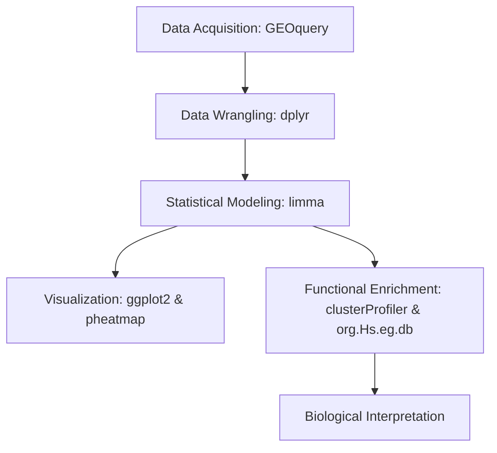

# 🧬 Portofolio Bioinformatika: Analisis Transkriptomik & Differentially Expressed Genes (DEGs)

**Silmi Aulia Putri**

[](#)
[](#)
[](#)


## Tentang Repositori Ini
Repositori ini berisi kumpulan tugas, mini-proyek, dan proyek akhir (*Capstone Project*) yang diselesaikan selama program **Bioinformatics Research Starter Program (BRSP)** oleh OmicsLite. Program pelatihan intensif ini menggunakan pendekatan *Project-Based Learning* (PBL) untuk mengeksplorasi analisis data *transcriptomics* (khususnya *Differentially Expressed Genes* / DEGs) secara komprehensif. 

Di dalam repositori ini, saya mendemonstrasikan alur riset bioinformatika secara utuh untuk meneliti respons genetik seluler terhadap infeksi virus dan kelainan metabolik. Tahapan mencakup literasi ilmiah, akuisisi basis data dari Gene Expression Omnibus (GEO), pemrosesan data statistik dengan R, hingga interpretasi fungsional biologis (*Enrichment Analysis*).

---

## 🌟 *Capstone Project* (Proyek Akhir)
Sebagai penugasan puncak, saya merancang dan mengeksekusi analisis komparatif ekspresi gen secara mandiri untuk membedah respons sel inang terhadap infeksi virus guna mendukung desain kandidat antigen vaksin *in-silico*.

* **Topik Riset:** Analisis Profil Transkriptomik *Host-Response* pada Infeksi Mpox Clade IIb (Mock vs MPXV).
* **Dataset:** `GSE219036` (Data TPM RNA-seq sel kulit manusia).
* **Laporan Komprehensif:** Silakan tinjau arsitektur riset, visualisasi publikasi, dan interpretasi patogenesis di dokumen **[Analisis Transkriptomik MPXV CladIIb](Analisis_Transkriptomik_MPXV_CladIIb.md)**.
* **Skrip R:** [`Pipeline_MPCV_Mock_CladIIb.R`](Pipeline_MPCV_Mock_CladIIb.R)
* **Dataset Mentah:** [`Dataset_GSE219036_TPM_for_GEO_upload_skin.txt.gz`](Dataset_GSE219036_TPM_for_GEO_upload_skin.txt.gz)
* **PPT Presentasi:** [`PPT`](PPT_CAPSTONE_PROJECT_BRSP.pdf)
* **Video Presentasi:** [`Video Presentasi`](https://youtu.be/-IUtCahX-Nc?si=BUGiukpE8oHOQeED)

---

## 📚 Rekam Jejak Pembelajaran (Minggu 1 - 3)
Selain proyek akhir, repositori ini mendokumentasikan proses pendalaman *tools* dan konsep secara bertahap:

### Minggu 1: Konseptual dan Literasi Ilmiah
Membangun fondasi analisis *transcriptomics* dan berlatih melakukan telaah kritis terhadap literatur mikrobiologi.
* 📄 **[Review Jurnal: Efek Glabridin pada Biofilm Staphylococcus aureus](Review-Jurnal-Efek-Glabridin-pada-Biofilm-Staphylococcus-aureus.md)**

### Minggu 2: Pengenalan Data & Analisis Berbasis Web (GEO2R)
Eksplorasi data microarray dari NCBI GEO (Dataset `GSE155489`) untuk memvalidasi kerusakan transkripsional pada sel granulosa ovarium.
* 📄 **[Analisis Patogenesis PCOS Melalui DEGs pada Sel Granulosa](Analisis%20Patogenesis%20PCOS%20DEGs%20pada%20Sel%20Granulosa.md)**

### Minggu 3: *Workflow* DEG Analysis menggunakan R
Menerapkan analisis reproduktif (*reproducible analysis*) menggunakan R untuk membandingkan subtipe *Normoandrogenic* (NA) dan *Hyperandrogenic* (HA) pada kondisi PCOS menggunakan dataset `GSE137684`.
* 📄 **Laporan Analisis:** **[Analisis Transkriptomik Normoandrogenic dan Hyperandrogenic PCOS](Analisis%20Transkiptomik%20Normoandrogenic%20dan%20Hyperandrogenic%20PCOS.md)**
* **Skrip Analisis:** [`Pipeline_PCOS_HA_NA.R`](Pipeline_PCOS_HA_NA.R)
* **Hasil Output (CSV):** [`Hasil DEGs_GSE137684_HA_vs_NA.csv`](Hasil%20DEGs_GSE137684_HA_vs_NA.csv)

---

## Tools & Ekosistem Packages

Proyek ini dibangun menggunakan bahasa pemrograman **R / RStudio**, dengan integrasi ketat pada ekosistem CRAN dan Bioconductor:



### Pengambilan & Manajemen Data
* **GEOquery:** Ekstraksi dataset microarray dan metadata otomatis dari basis data NCBI GEO.
* **dplyr:** Manipulasi dan transformasi struktur matriks ekspresi (*data wrangling*).

### Analisis Statistik & Differential Expression
* **limma:** *Package* utama untuk pemodelan linear eksperimen (*design matrix*, *contrasts*), komputasi *fold-change*, dan penapisan signifikansi menggunakan *Empirical Bayes*.

### Anotasi Gen & Functional Enrichment
* **org.Hs.eg.db:** Basis data anotasi genom manusia untuk konversi *Probe ID* menjadi *Gene Symbol* dan *Entrez ID*.
* **clusterProfiler:** Eksekusi pengayaan fungsi biologis (*Gene Ontology*) dan pemetaan jalur (*KEGG Pathways*).
* **enrichplot:** Visualisasi hasil pengayaan fungsional tingkat lanjut (*Dotplot*).

### Visualisasi Data Beresolusi Tinggi
* **ggplot2 & ggrepel:** Pembuatan grafik standar publikasi seperti *Volcano Plot*, *Boxplot*, dan *Density Plot* dengan anotasi teks anti-tumpang tindih.
* **pheatmap:** Konstruksi *Heatmap* hierarkis berskala Z-score.
* **umap / prcomp (Base R):** Reduksi dimensi spasial untuk validasi pemisahan pola varians (PCA/UMAP).

### Cara Mereproduksi Analisis
Jika Anda ingin meninjau atau mengeksekusi skrip R di lingkungan lokal Anda, ikuti langkah berikut:

1. **Kloning repositori ini:**
   ```bash
   git clone [https://github.com/silmiaulptr/BRSP_Project.git](https://github.com/silmiaulptr/BRSP_Project.git)
   cd BRSP_Project
   ```
2. **Persiapkan Lingkungan RStudio:**
Buka file .Rproj (jika ada) atau atur working directory Anda ke dalam folder proyek ini.

3. **Instalasi Dependensi Bioconductor:**
Jalankan skrip berikut di konsol R Anda untuk memastikan seluruh packages inti terinstal:
```
if (!require("BiocManager", quietly = TRUE))
    install.packages("BiocManager")

BiocManager::install(c("GEOquery", "limma", "clusterProfiler", "org.Hs.eg.db", "enrichplot", "pheatmap"))
install.packages(c("dplyr", "ggplot2", "ggrepel", "umap"))
```
4. **Eksekusi Pipeline:**
Buka skrip Pipeline_MPCV_Mock_CladIIb.R atau Pipeline_PCOS_HA_NA.R dan jalankan baris per baris (Run line-by-line) untuk mengamati proses transformasi data secara langsung.
