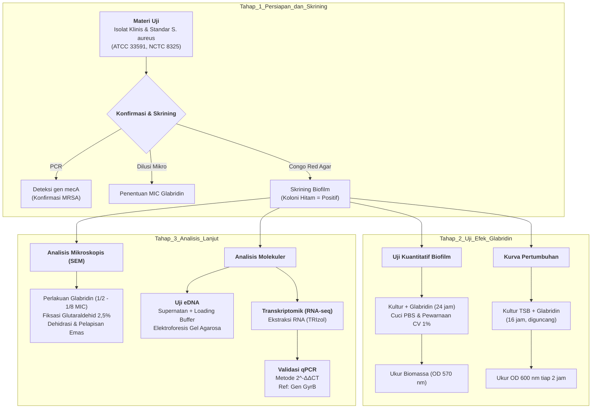

# Rangkuman Review Jurnal: Efek Glabridin pada Biofilm S. aureus

## Identitas Jurnal
**Judul:** Transcriptomic Analysis of the Effect of Glabridin on Biofilm Formation in Staphylococcus Aureus  
**Penulis:** Ma et al. (2025)  
**Jurnal:** Foodborne Pathogens and Disease  
**DOI:** [10.1089/fpd.2024.0038](https://doi.org/10.1089/fpd.2024.0038)

---

## PENDAHULUAN
Patogen utama penyebab infeksi kulit pada hewan dan manusia merupakan *Staphylococcus aureus*, dengan kemampuannya dalam membentuk biofilm patogen ini menjadi penyebab utama infeksi bakteri kronis dan penyebaran resistensi obat seperti *Methicilin Resistant S. aureus* (MRSA) (Deng et al., 2022). Glabridin (Glb), sebuah flavonoid alami dari ekstrak akar manis (*licorice*), diketahui memiliki sifat antibakteri (Chirumbolo, 2016). Penelitian ini bertujuan untuk menginvestigasi aktivitas penghambatan Glb terhadap pembentukan biofilm *S. aureus* dan memahami mekanisme molekuler di baliknya melalui analisis transkriptomik.

### Metode
Penelitian terbagi menjadi 3 tahap:

1.  **Persiapan dan Skrining Strain**
    Isolat yang digunakan adalah isolat klinis dan strain standar (ATCC 33591, NCTC 8325). Gen *mecA* dideteksi dengan PCR untuk konfirmasi strain MRSA. Dilakukan penentuan *Minimum Inhibitory Concentration* (MIC) Glabridin menggunakan metode dilusi mikro. Lalu skrining biofilm dengan agar Congo Red, koloni hitam kering menandakan positif penghasil biofilm.

2.  **Uji Efek Glabridin**
    Dilakukan secara kuantitatif kultur bakteri dengan berbagai konsentrasi Glabridin diinkubasi 24 jam, dicuci dengan PBS, dan diwarnai dengan *Crystal Violet* 1%. Biomassa diukur pada OD 570 nm. Kemudian bakteri dikultur dalam TSB dengan Glabridin (MIC hingga 1/4 MIC) selama 16 jam sambil diguncang. Kepadatan optik (OD 600) diukur setiap 2 jam.

3.  **Analisis Mikroskopis Biofilm dan Molekuler**
    Biofilm ditumbuhkan pada *cell crawls* dengan perlakuan Glabridin (1/2, 1/4, 1/8 MIC). Sampel difiksasi dengan glutaraldehid 2,5%, didehidrasi dengan seri etanol (25%-100%), dilapisi emas, dan diamati strukturnya. Kemudian penghambatan eDNA dilihat dari supernatan biofilm yang dicampur *loading buffer*, dan dijalankan pada elektroforesis gel agarosa untuk melihat ekspresi eDNA. Lalu analisis transkriptomik dilakukan dengan mengekstraksi total RNA dengan kit TRIzol dari sampel biofilm. Validasi data RNA-seq pada 7 gen terkait biofilm dilakukan dengan menggunakan metode 2^-ΔΔCT dengan gen *GyrB* sebagai referensi.

### Visualisasi Metode

### Hasil
Uji *crystal violet* menunjukkan bahwa Glabridin secara signifikan menekan ekspresi biofilm (Yang et al., 2022) dengan konsentrasi penghambatan minimum sebesar 2 μg/mL. Pengamatan SEM mengungkapkan bahwa Glabridin merusak struktur spasial biofilm, mengurangi adhesi bakteri, dan menghancurkan kluster sel secara drastis. Glabridin juga terbukti menghambat sekresi eDNA, komponen penting matriks biofilm (Dos Santos Rodrigues et al., 2017).

### Pembahasan
Analisis RNA-seq mengidentifikasi 184 gen yang berbeda ekspresinya, 81 gen mengalami *upregulated* dan 103 gen *downregulated*. Glabridin mengatur tingkat transkrip gen terkait biofilm melalui sistem transferase fosfat (PTS), sistem regulasi dua komponen, dan metabolisme nitrogen (Vaishampayan et al., 2018). Validasi qPCR menunjukkan Glabridin menurunkan regulasi gen *icaD* (penting untuk pembentukan biofilm) namun meningkatkan regulasi gen adhesin permukaan seperti *ClfA* dan *FnbA*, serta regulator *SarA*. Peningkatan *SarA* diduga sebagai respons pertahanan bakteri terhadap serangan obat.

---

## PENUTUP
Studi ini menyimpulkan bahwa Glabridin memiliki efek penghambatan yang signifikan terhadap aktivitas biofilm *S. aureus* dan berpotensi menjadi obat anti-biofilm yang efektif. Mekanisme utamanya melibatkan penghambatan sekresi eDNA dan gangguan pada struktur biofilm melalui regulasi genetik pada sistem metabolisme dan adhesi bakteri.

## DAFTAR PUSTAKA

* Chirumbolo, S. (2016). Commentary: The antiviral and antimicrobial activities of licorice, a widely-used Chinese herb. *Frontiers in Microbiology*, *7*, Article 531. https://doi.org/10.3389/fmicb.2016.00531
* Deng, W., Lei, Y., Tang, X., et al. (2022). DNase inhibits early biofilm formation in *Pseudomonas aeruginosa*- or *Staphylococcus aureus*-induced empyema models. *Frontiers in Cellular and Infection Microbiology*, *12*, Article 917038. https://doi.org/10.3389/fcimb.2022.917038
* dos Santos Rodrigues, J. B., de Carvalho, R. J., de Souza, N. T., et al. (2017). Effects of oregano essential oil and carvacrol on biofilms of *Staphylococcus aureus* from food-contact surfaces. *Food Control*, *73*, 1237–1246. https://doi.org/10.1016/j.foodcont.2016.10.043
* Vaishampayan, A., de Jong, A., Wight, D. J., et al. (2018). A novel antimicrobial coating represses biofilm and virulence-related genes in methicillin-resistant *Staphylococcus aureus*. *Frontiers in Microbiology*, *9*, Article 221. https://doi.org/10.3389/fmicb.2018.00221
* Yang, X., Lan, W., & Xie, J. (2022). Antimicrobial and anti-biofilm activities of chlorogenic acid grafted chitosan against *Staphylococcus aureus*. *Microbial Pathogenesis*, *173*(Pt A), Article 105748. https://doi.org/10.1016/j.micpath.2022.105748
